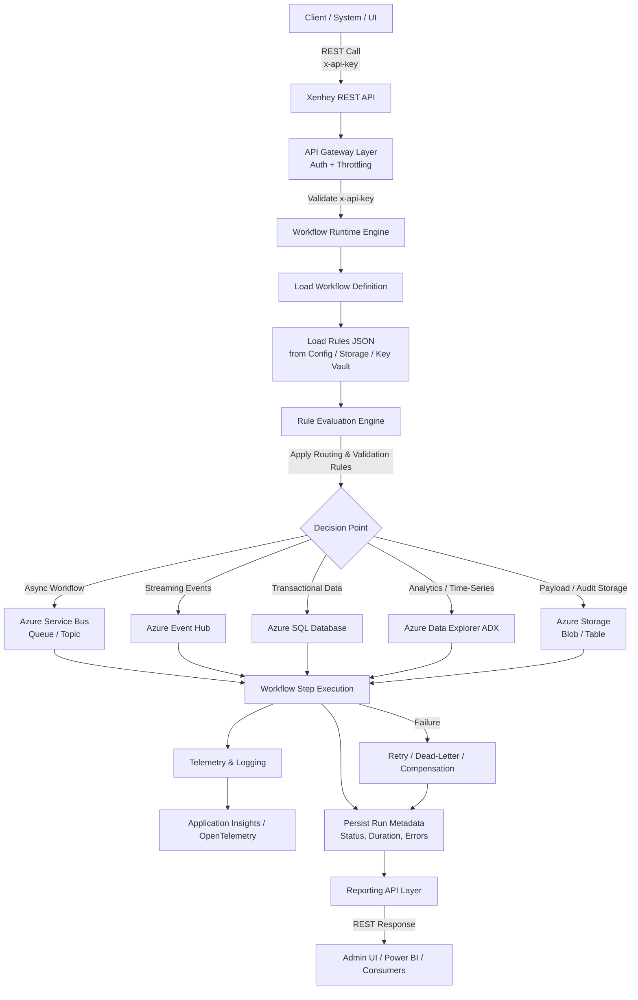

## Xenhey — From Design Meetings to Live Collaboration

**Xenhey fundamentally changes how integration projects are designed, reviewed, and delivered.**
Instead of long meetings debating specifications, APIs, and implementation details, Xenhey provides a **shared, real-time workspace** where outcomes are built, reviewed, and published live.

At its core, Xenhey includes tooling that allows end clients—not just developers—to **create, edit, and publish content directly to RESTful APIs** in multiple formats:

* **HTML** (UI fragments, forms, views)
* **JSON** (schemas, payloads, rules, configurations)
* **XML** (legacy or standards-based integrations)
* **Plain text** (templates, instructions, metadata)

Below is a **clear, executive-ready “Before vs After Xenhey” comparison** you can use in a README, sales deck, or client proposal. It’s written to highlight **behavioral change, delivery speed, and collaboration impact**—not just tooling.

---

## 🚦 Before vs After Xenhey

### How Integration Projects Change with Xenhey

| Dimension              | **Before Xenhey**                              | **After Xenhey**                                 |
| ---------------------- | ---------------------------------------------- | ------------------------------------------------ |
| **Client Involvement** | Clients review static docs, slides, or mockups | Clients work directly in a shared live workspace |
| **Meetings**           | Design-heavy, abstract discussions             | Working sessions with real-time updates          |
| **Artifacts**          | Specs, PDFs, tickets, emails                   | Live HTML, JSON, XML, and text artifacts         |
| **Feedback Loop**      | Days or weeks between feedback and changes     | Immediate, in-session feedback and updates       |
| **Change Process**     | Raise a ticket → wait → redeploy               | Edit → publish → see results instantly           |
| **Source of Truth**    | Spread across docs, repos, and messages        | Centralized workspace with live state            |
| **Client Confidence**  | Based on explanations and promises             | Based on visible, working outputs                |
| **Iteration Speed**    | Slow, batch-oriented                           | Fast, continuous, real-time                      |
| **Rework Risk**        | High due to misinterpretation                  | Low due to shared visibility                     |
| **Delivery Timeline**  | Extended by handoffs and clarifications        | Compressed through live collaboration            |
| **Developer Load**     | High (constant translation of requirements)    | Focused on high-value engineering                |
| **Governance & Audit** | Manual tracking of changes                     | Built-in versioning and traceability             |
| **API Exposure**       | Implemented late in the cycle                  | Available and testable from day one              |
| **Client Ownership**   | Passive consumer                               | Active co-creator                                |

All content is versioned, published, and immediately executable through a secure REST layer.

---

## A New Working Model: Shared Workspace, Real-Time Outcomes

Traditional delivery models rely on:

* Design meetings
* Static documents
* Back-and-forth clarification
* Long feedback cycles
* Misalignment between intent and implementation

**Xenhey replaces that model with a live workspace.**

### What the workspace enables

* A **shared environment** between delivery teams and end clients
* Real-time visibility into:

  * workflows
  * rules
  * payloads
  * UI artifacts
  * API outputs
* Immediate feedback loops where:

  * changes are made *during* discussions
  * results are visible instantly
  * alignment happens in-session

Meetings shift from *“discussing what we might build”*
to *“making changes together and seeing the result immediately.”*

---

## Real-Time Publishing, Not Static Hand-Offs

With Xenhey:

* Content is **authored once** and **published directly to REST endpoints**
* Updates propagate **in real time** across:

  * workflows
  * APIs
  * reporting views
  * client-facing outputs
* No waiting for redeployments or re-implementation cycles for every change

This allows:

* Faster iteration
* Fewer misunderstandings
* Reduced dependency on developer availability for minor updates

---

## Why This Matters to the End Client

### For business stakeholders

* They can **see progress live**, not in slide decks
* They can **participate directly** in shaping outputs
* They gain confidence because changes are tangible and immediate

### For delivery teams

* Fewer rework cycles
* Clear, shared source of truth
* Less time translating requirements into code
* More time focused on higher-value engineering

### For leadership

* Shorter delivery timelines
* Reduced project risk
* Predictable outcomes
* Stronger client trust and engagement

---

## Meetings Become Working Sessions

Xenhey intentionally reframes collaboration:

> **Meetings are no longer about debating designs or explaining implementation details.
> Meetings become working sessions where updates are made live in the shared workspace.**

* Clients see the impact of decisions immediately
* Trade-offs are evaluated in real time
* Alignment happens faster and sticks longer

---

## The Strategic Value

Xenhey is not just an integration runtime or tooling platform.
It is a **collaboration accelerator** that:

* Collapses the distance between idea and execution
* Removes friction between clients and delivery teams
* Turns APIs and workflows into living, shared artifacts
* Makes integration projects more transparent, predictable, and efficient

---

## One-Sentence Executive Summary

> **Xenhey enables real-time, collaborative integration delivery—allowing clients and teams to create, publish, and evolve APIs, workflows, and content together in a shared workspace, transforming meetings from design discussions into live execution.**

---

---

## 🧠 The Fundamental Shift

### **Before Xenhey**

* Meetings are about *explaining intent*
* Deliverables are *descriptions of what will exist*
* Progress is inferred, not observed
* Clients wait for implementation to validate ideas

### **After Xenhey**

* Meetings are about *making changes live*
* Deliverables are *working artifacts*
* Progress is visible and measurable
* Clients validate ideas immediately

---

## 🎯 What Actually Improves

### Velocity

* Fewer handoffs
* Fewer clarifications
* Faster approvals

### Quality

* Less misalignment
* Fewer surprises late in delivery
* Clear, shared understanding

### Trust

* Clients see what’s happening in real time
* No black-box implementation phase
* Stronger partnership dynamic

---

## 🧩 Why This Matters Strategically

Xenhey doesn’t just optimize integration workflows.
It **changes how teams and clients collaborate**:

> From *“tell me what you want”*
> to *“let’s build it together—right now.”*

That shift:

* Reduces project risk
* Improves stakeholder confidence
* Makes delivery more predictable
* Elevates the role of the platform from tool to enabler

---

## 🧾 One-Line Summary for Slides

> **Xenhey replaces design-heavy integration projects with real-time, collaborative delivery—turning meetings into live working sessions and clients into active contributors.**

---

# 🚀 Xenhey

### Workflow-Driven Azure Integration Runtime (NuGet-Delivered)

> **Build, orchestrate, and operate Azure integration workflows—without writing custom glue code.**
> Xenhey is a workflow-driven Azure integration runtime delivered as a NuGet DLL. It provides plug-and-play connectors for Azure messaging, storage, and data platforms, with a uniform REST layer for execution, observability, and reporting.

---

## ✨ What Xenhey Solves

Modern Azure integrations often require:

* Multiple SDKs and custom connectors
* Repeated retry, logging, and error-handling logic
* Inconsistent security and observability patterns

**Xenhey standardizes all of this into a single runtime.**

---

## 🧩 Key Capabilities

* 🔁 **Workflow-Driven Orchestration**
  Define end-to-end integration workflows using JSON rules and configuration.

* 🔌 **Plug-and-Play Azure Connectors**
  Native support for Service Bus, Event Hubs, Azure SQL, Azure Data Explorer (ADX), and Azure Storage.

* 🌐 **REST-First Execution & Reporting**
  Trigger workflows, query run history, and fetch metrics via consistent REST APIs.

* 🔐 **Enterprise-Ready Security**
  `x-api-key` support, Managed Identity, and policy-driven access controls.

* 📊 **Built-In Observability**
  Correlated telemetry, step-level metrics, retries, and failure tracking.

* 📦 **NuGet-Delivered Runtime**
  Drop Xenhey into APIs, Functions, Workers, Containers, or AKS workloads.

---

## 🏗️ Designed For

* Azure Architects & Platform Engineers
* Event-Driven & Data Ingestion Pipelines
* Enterprise Integration & Governance Teams
* SRE & Observability-Focused Organizations

---

## ⚡ Why Xenhey

> **Configure workflows, not code connectors.**
> Xenhey accelerates delivery, enforces consistency, and simplifies operations across Azure integration workloads.

---

## What Xenhey is (in plain English)

**Xenhey is an integration runtime + workflow engine packaged as a NuGet-deployed DLL** that you drop into your .NET service (API, Worker, Function, etc.). Once installed, it provides:

* A **standard way to connect** to multiple Azure resources (messaging, data, storage, analytics)
* A **workflow/process layer** that orchestrates steps like “ingest → validate → enrich → route → persist → report”
* A consistent **REST interface** for running workflows and retrieving operational/analytics reporting (everything is “a REST call”)

Think of it as:
**“A plug-in integration runtime that turns Azure resources into reusable workflow steps—without rewriting custom connectors every time.”**

---

## Core building block: the NuGet runtime DLL

### Why a NuGet runtime matters

Shipping Xenhey as a NuGet package means:

* **Fast adoption**: dev teams add one dependency instead of pulling multiple SDKs + writing glue code
* **Consistent patterns**: same retry policies, logging, error handling, telemetry, auth
* **Versioned capability**: connector improvements roll out like normal package upgrades
* **Host flexibility**: can run inside:

  * ASP.NET Web API
  * Azure Functions (isolated worker)
  * Worker Service
  * Container Apps / AKS microservices

### What the runtime “does” at startup

The Xenhey runtime typically:

1. Loads configuration (JSON/YAML/appsettings/Key Vault)
2. Registers connectors (Service Bus, Event Hub, SQL, ADX, Storage, Azure Document Search, All Openapi systems etc.)
3. Wires cross-cutting concerns:

   * Managed Identity / service principal auth
   * retries + backoff
   * circuit breakers
   * structured logging + correlation IDs
   * metrics + tracing (App Insights / OpenTelemetry)
4. Exposes workflow endpoints via REST

---

## The workflow/process-driven model

Xenhey is not “just a connector library.” The key is the **workflow engine**:

### Workflow = a chain of steps

A workflow is a named process made of steps such as:

* **Trigger step**

  * HTTP request
  * Service Bus subscription message
  * Event Hub batch
  * Blob-created event
* **Transform step**

  * mapping fields
  * JSON normalization
  * schema enforcement
* **Route step**

  * based on rules (x-api-key-based routing)
  * push to Service Bus topic, Event Hub, SQL, ADX, Storage
  * The ability to extent via new conectors to more workflows
* **Persist step**

  * SQL insert/merge
  * ADX ingestion
  * store blob/file + metadata
* **Report step**

  * produce workflow run summary
  * expose the output via REST

### Why “process-driven” matters

This design makes Xenhey good for repeatable enterprise workflows:

* onboarding pipelines
* ingestion pipelines
* event-to-data lake patterns
* “fan-out” to multiple sinks (SQL + ADX + Storage)
* auditing and traceability across steps

---

## Connectors Xenhey supports (conceptually)

### Azure Service Bus (queue/topic/subscription)

Xenhey connector typically supports:

* Send message (with headers, correlation, scheduled delivery)
* Receive/peek/lock/complete/abandon/dead-letter
* Topic publish with routing properties
* Retry + DLQ handling baked into workflow policies

**Use case:** orchestrate business workflows reliably (exactly-once-ish patterns, idempotency, compensations).

---

### Azure Event Hubs

Xenhey connector typically supports:

* Publish events in batches
* Consume events with checkpoints
* Attach metadata (partition key, event properties)
* Stream-oriented ingestion into ADX or other stores

**Use case:** telemetry-style ingestion, high-throughput streaming into analytics.

---

### Azure SQL Database

Xenhey connector typically supports:

* Parameterized queries
* bulk insert/merge patterns
* stored procedure execution
* transactional steps within a workflow
* idempotency keys to avoid duplicate writes

**Use case:** operational persistence, reporting tables, integration state.

---

### Azure Data Explorer (ADX / Kusto)

Xenhey connector typically supports:

* ingest JSON/CSV/parquet
* KQL query execution
* “workflow telemetry” tables (e.g., runs/errors/latency)
* time-series analytics reporting

**Use case:** near-real-time analytics + powerful KQL reporting.

---

### Azure Storage (Blob / Table / Queue / Files)

Xenhey connector typically supports:

* write blobs + metadata tags
* read blobs for processing
* table storage for lightweight state + audit records
* queue storage for simple buffering (if used)

**Use case:** durable payload storage, replay, audit trail, cheap state store.

---

## “All reporting is REST calls” — what that really means

Xenhey’s philosophy is typically:

1. **Every workflow run** produces structured run data (start/end, steps, success/failure, durations)
2. That data is persisted (SQL/ADX/Storage Table) in a standardized format
3. Xenhey exposes reporting through REST endpoints like:

* `GET /api/workflows` → list workflows
* `POST /api/workflows/{name}/run` → trigger a workflow
* `GET /api/runs?workflow=name&from=&to=` → list runs
* `GET /api/runs/{runId}` → full run details (step-by-step)
* `GET /api/runs/{runId}/logs` → correlated logs
* `GET /api/metrics?workflow=name` → aggregates (success rate, latency, throughput)
* `GET /api/resources/health` → connection checks to SB/EH/SQL/ADX/Storage

That means consumers (Power BI, dashboards, admin portals, SRE tooling) don’t need direct DB/Kusto access—**they just call the API**.

---

## Operational value (why this is better than “custom glue code”)

### Standardization

* One consistent integration pattern across many Azure services
* Same authentication method (Managed Identity strongly preferred)
* Same error model (validation vs transient vs fatal)
* Same retry/backoff strategy

### Governance + security

* Centralized policies:

  * allowed resources
  * approved topics/hubs/tables
  * RBAC-controlled access
* Secrets handled properly (Key Vault, MI) instead of config sprawl
* Clear audit trails: who ran what workflow, what data moved where

### Observability (SRE-friendly)

* Correlation ID from REST request → Service Bus message → SQL/ADX writes
* Unified telemetry: step duration, connector latency, failure reasons
* Easy “run replay” if blob payload + run metadata are retained

---

## Typical runtime architecture (high-level)

**Host app (your API or Function)**

* references Xenhey NuGet runtime DLL
* reads config
* Xenhey registers connectors
* Xenhey loads workflow definitions
* exposes REST endpoints
* writes run history + metrics to SQL/ADX
* logs to App Insights

**Your consumer UI / Power BI / admin portal**

* never calls Azure resources directly
* calls Xenhey REST endpoints for:

  * run workflows
  * query run history
  * fetch metrics / reports

---

### Xenhey Workflow – Rules-Driven, API-Secured

---

## What this diagram communicates (talk track)

### 1️⃣ Secure API entry

* All workflow execution and reporting is exposed via **REST**
* Every call is authenticated using an **`x-api-key`**
* Optional throttling, IP allowlists, or RBAC can sit at the API layer

---

### 2️⃣ Rules are JSON-driven

* Workflow behavior is **not hardcoded**
* Rules are defined in **JSON** (routing, validation, thresholds, destinations)
* Rules can be stored in:

  * Azure Storage
  * Azure SQL
  * Azure App Config
  * Azure Key Vault (secured)

Example rule intent:

* *“If eventType = Billing → send to Service Bus + SQL”*
* *“If telemetry → Event Hub + ADX”*
* *“If payload > 5MB → Blob Storage”*

---

### 3️⃣ Workflow runtime orchestration

* Xenhey runtime evaluates rules
* Determines:

  * which Azure service to call
  * sync vs async execution
  * retry and failure behavior
* Same runtime, different workflows — purely config-driven

---

### 4️⃣ Multi-target Azure integration

From the same workflow execution:

* **Service Bus** → business workflows
* **Event Hub** → high-throughput streams
* **Azure SQL** → operational data
* **ADX** → analytics and observability
* **Storage** → raw payloads and audit trails

---

### 5️⃣ Built-in observability and reporting

* Every step emits:

  * execution time
  * success/failure
  * correlation ID
* Telemetry flows to App Insights / OpenTelemetry
* Run metadata is persisted and exposed via **REST reporting APIs**
* No direct DB or Kusto access needed for consumers

---

### 6️⃣ Failure handling is first-class

* Retries, DLQs, and compensations are workflow-aware
* Failures are still reported via REST
* Enables replay and forensic analysis

---

